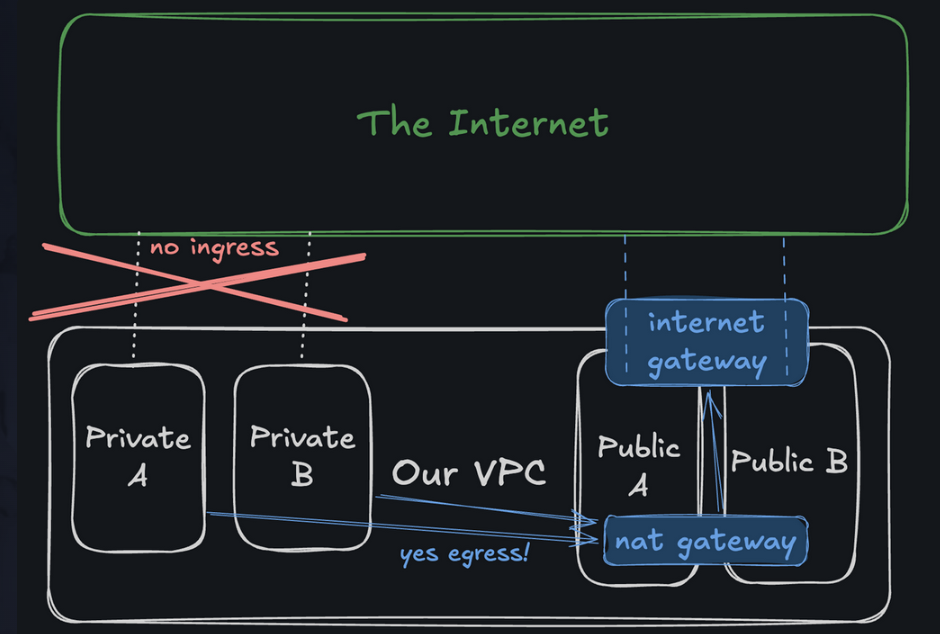

# Lecture 1: Virtual Private Cloud

VPC (Virtual Private Cloud): is the "box" in which we have all the resources.

# Lecture 2 & 3: CIDR Blocks

### What is a CIDR block?

- CIDR stands for **Classless Inter-Domain Routing**, which tells us how many addresses can exist inside that VPC.

- IPv4 addresses start from 0.0.0.0 and goes up to 255.255.255.255, where each segment, after a segment hits 255, rolls over to zero by incrementing the previous segment --> For example: 10.20.30.255 + 1 = 10.20.31.0

### CIDR describes a block of IP addresses in terms of a starting address and a size:
1. FORMAT --> **starting.address.goes.here/size**
2. The size suffix follows the formula 2^(32 - size) = number_of_addresses. So a larger suffix actually means fewer addresses.

### What we created:
- we created a CIDR of `10.0.0.0/22`:
    - starting address = 10.0.0.0
    - number of addresses = 1024
    - ending address = 10.0.3.255
    - Network address = 10.0.0.0
    - Broadcast address = 10.0.3.254
    - First usable: 10.0.0.1
    - last usable: 10.0.3.254
    - Technically, the number of addresses available = 1022


# Lecture 4: Subnetting
- can split into:
    - public subnets: such that anyone can reach it from the internet
    - private subnets: where can we put a database with our user's data

- can connect each subnet with different Availability Zones(AZ):
    - power cut in one AZ/datacenter SHOULD NOT affect the other 

- created 4 subnets:
    - 2 private --> each in different AZs
    - 2 public --> each in different AZs 
    - all 4 in same region us-east-1


# Lecture 5: internet Gateways (IGW)

- The CIDR block && the subnets in it, are technically CUT OFF from the internet as this is a "closed box" / "a building with no doors"
- to connect these IP addresses to internet - we need 2 things:
    1. **Internet Gateway (IGW)** - it needs to be created and attached to the VPC level and not the subnet level.
    2. **Route in Routing Table** - this tells traffic `from subnet to internet` to go through the IGW. Without this route, even an attached IGW is useless.


# Lecture 6: Route Tables

- subnets dont even know if IGW exists
- So, we need to **create a route** in **Routing Table**
- Routing table helps us to create rules. For now, we will be creating a **default route** which basically says, *"if you don't have a specific address for something, we send it to the internet"*.

- While adding rules: **destination = 0.0.0.0/0 is the "everything CIDR"** --> which basically means it is the default route

Till now, we have connected our public subnets with the internet.


# Lecture 7: Private Subnets

- A private subnet is a subnet whose resources are not accessible from the internet directly, but can still have some internet connectivity.

- We "could" leave everything in a public subnet and regulate access with a firewall. However, **WE SHOULD PREFER belt and suspenders approach** to security for multiple layers of protection.
    - One good option is to use a NAT (Network Address Translation), which lets us keep a subnet private but still allow outbound access when we need it.


### NAT (Network Address Translation)

- it is NOT a VPC-level component like IGW - so it needs to be set up in public subnets which have access to the internet
- hence it is deployed inside a public subnet and is given its own Elastic IP (public IP)

###### The NAT Gateway itself needs to reach the internet to forward traffic on behalf of your private instances. To do that, it needs a path to the IGW --> which only exists for public subnets. So the NAT Gateway sits in Public A, uses the IGW to get to the internet, and acts as a middleman.

###### Full traffic flow

```cpp
Private A instance (private IP only)
        │
        │  1. Sends packet to NAT Gateway
        ▼
NAT Gateway (sitting in Public A)
        │
        │  2. Replaces Private A's IP with its own Elastic IP
        │     (this is the "translation" in NAT = Network Address Translation)
        ▼
Internet Gateway (VPC-level)
        │
        │  3. Forwards to the internet
        ▼
     Internet

Return traffic comes back the same way in reverse.
The internet only ever sees the NAT's Elastic IP — never Private A's IP.
```

- ADVANTAGE: The internet never learns Private A's real IP address, so it has no way to initiate a connection back — that's what gives you the "no ingress" guarantee for private subnets.

### Final Architecture

