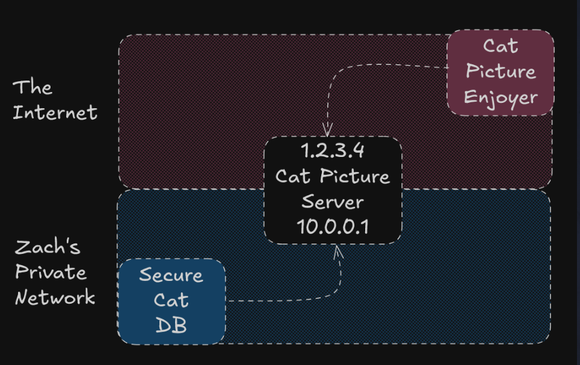

# Lecture 1: EC2 Instance Configuration: Keys

- We need to get the PatientPing application running on a server, but first we need a secure way to connect to that server. Usually, this is done with `ssh` and a key pair.

    - public key & private key are the 2 parts

1. created using the `ssh-keygen` command on my laptop, whilst creating:
    1. Two files are created at the intended location, and those will be the private and public key
    2. we can see a "fingerprint" in the terminal which is basically a SHA-256 hash of our public key
    3. randomart image which is basically a ASCII picture of the hash to see visually

2. Imported that key in aws ec2 using wsl cli --> It can also be seen now in `EC2 → Network and Security → Key Pairs`


# Lecture 2: EC2 Instances

Launching a t3.micro EC2 instance named patientping-web in patientping-public-a.
- while creating the EC2 instance, I need to `EDIT` the network settings in order to select my own VPC and subnet


# Lecture 3: AMIs

Think of an AMI like a master mold. Every EC2 instance you launch is a copy cast from that mold. The mold contains:
1. The operating system (e.g., Amazon Linux, Ubuntu)
2. Any software pre-installed on it (e.g., Nginx, Node.js, your app)
3. The storage configuration — which volumes to attach and how
When you pick an AMI and hit "Launch Instance," AWS takes that frozen image and boots a  **BRAND NEW VIRTUAL MACHINE** from it in seconds.

- **AMI creates a VM instance as compared to Docker which creates only a container which will eventually run on a VM.**
- Neither AMI nor Docker control hardware; both of them are software-level concepts.

# Lecture 4: Public IPs

The important idea for us is that servers in an AWS VPC usually communicate with one another using private IP addresses, and use public IP addresses only to communicate with systems outside the VPC (like the internet).

All of our servers on AWS have private IP addresses, and some will also have public addresses, but only if necessary

#### IMPORTANT NOTE: Any IPv4 address that starts with `10.` is private.



Just because the server is catering to users outside the private network, that's why we need to give it a public IP. The public IP in this case is 1.2.3.4. If our only use case was to cater to users in the private network, then we could have used only the private address, which was 10.0.0.1.

# Lecture 5: Elastic IPs

The downsides of regular public IPs
- It can change any time your server is stopped and restarted. --> Any client hardcoded to that IP would lose connection.
- You can't attach it to a different server.a

Elastic IPs:
1. They belong to the AWS account and not to a specific instance, and that's why they never change.
2. It's detachable and movable — you can unplug it from one instance and attach it to another in seconds

# Lecture 6: Firewalls/Security Groups

Created a firewall such that it allows me to SSh into the EC2 instance (Inbound rule) and allow all traffic outside (outbound rule)

# Lecture 7: SHH into our server

##### Here's a review of the networking flow for us to SSH into our server:

1. Our computer communicates with the server's public Elastic IP address.
2. The server is in a public subnet with a route to the internet gateway.
3. The security group allows inbound traffic on 22/tcp from our public IP address.
4. Our SSH private key matches the public key we uploaded to AWS.


#### Steps taken:
I took the IP address of the EC2 and I created a `config` file in `.ssh` , which helps me to SSH directly always.


# Lecture 9: OPen Web traffic
- created a new rule for the firewall and "poked a hole" for all traffic at port 8080

# Lecture 10: Creating an AMI from our already setup EC2 instance

#### Why Create an AMI?
1. Simple backup: You can snapshot a running server so that if something goes wrong, you can launch a new instance from that image and get back to a known good state.
2. Cold store and save on costs: Instead of leaving a server running 24/7 when you don't need it, you can create an AMI, terminate the instance, and later launch a new instance from the AMI when you need it again. You pay only for the (cheaper) storage of the AMI/snapshot until you spin the server back up.
3. Transfer to a different region: AMIs are region-specific. If you want to run the same setup in another region, you can copy your AMI to that region and launch instances there. Handy for disaster recovery or moving closer to your users.
4. Cookie cutter for new servers: Once you have a server configured the way you want (OS, app, config), you can create an AMI from it and use that AMI as the basis for new instances (we'll talk more about this soon).

# Lecture 11: Benefits of Reserved Instances & Savings Plans

# Lecture 12: Auto Scaling Groups (ASGs)

- Auto Scaling Groups (ASGs) help with scaling of the count of servers. We can give AWS an AMI and tell it how many instances we want.
- This gets even more powerful as we instrument our servers. If a server starts to get busy, AWS can automatically provision more. If servers are sitting idle, we can reduce the server count.


# Lecture 13: Launch Template

- AMI is an image of the software on the server --> but a launch template goes one step further:
- **it also captures the "hardware" (instance type), the network configuration (subnet, security groups), and more.**
- It's a way to say, "This is the exact configuration I want for new servers."


# Lecture 14: Launch form a Template
- The very first time you SSH into any server, your machine saves that server's host key (the server's unique identity fingerprint) into ~/.ssh/known_hosts, mapped to its IP address. It essentially records: "The server at IP 54.23.x.x has this identity."
- Every subsequent connection, SSH checks: "Does the server at this IP still have the same identity as last time?"

- But now when we have created a new server from the template (or in any way) --> The IP address (your Elastic IP) stayed the same, but the server behind it is entirely different.

# Lecture 15: Spot Instances

Savings plans are great, but what if you want to save even more money? Allow me to introduce you to spot instances.

Imagine you're in AWS' shoes. You have to build out new racks of servers to keep up with demand, and you want to streamline things, so you install not just what you need today but what you think you'll need for the next few years. This leads to a problem: what to do with all the new capacity that's not being used yet?

#### AWS lets you bid on this unused capacity with no long term commitment at a ~90% discount. With one small caveat.

```cpp
Dear Zach,
I'll give you this massive discount, but be warned, at any time I may literally delete your server. Don't worry, I'll give you a 2-minute heads-up.
Love, Jeffy B
```

- For a stateless application that only needs to do async or offline compute, spot instances might be the perfect choice.
    - Since, if a server dies, no worries, you can just start a new one and pick up where you left off.
- But if you need to be always on, spot instances are not a good fit.

# Lecture 16: Stateful and Stateless Applications

Stateful = stores critical data that can't easily be recreated either in memory or on disk.
Stateless = stores no critical data; operates on data as it passes through the network.